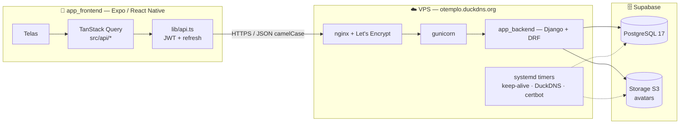
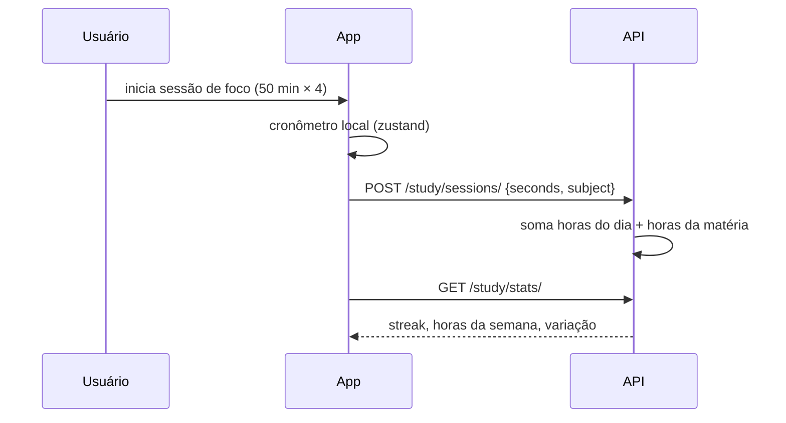

<p align="center">
  
</p>

<h1 align="center">O Templo · Atelier Noir</h1>

<p align="center">
  Um sistema pessoal de disciplina: estudo, hábitos, treino e finanças em um só lugar,<br/>
  com a estética de um ateliê noturno — preto, branco e silêncio.
</p>

<p align="center">
  <a href="https://otemplo.duckdns.org/api/docs/"></a>
  
  
  
  
</p>

---

## Para que serve

A maioria dos apps de produtividade cuida de **uma** coisa: um para hábitos, outro para pomodoro, outro para treino, outro para dinheiro. O Templo parte da ideia de que disciplina é um só músculo, exercitado em quatro frentes que se alimentam:

| Pilar | O que você acompanha | O que o app faz por você |
|---|---|---|
| **Estudos** | matérias, horas, cronograma, flashcards | cronômetro de foco em ciclos que registra as horas sozinho; revisão espaçada; sequência de dias estudando |
| **Hábitos** | rituais diários por período do dia | check por dia da semana, hábitos quantitativos (ex.: 3 L de água), sequência e consistência calculadas dos registros |
| **Treino** | fichas com exercícios, cargas e séries | sessão cronometrada que marca o dia, volume levantado e tonelagem semana a semana |
| **Finanças** | receitas, despesas, aportes, alocação | resumo por mês/trimestre/ano, evolução do patrimônio, teto de despesas |

A **Home** consolida a semana atual dos quatro pilares; o **Perfil** guarda as metas (horas de estudo, treinos por semana, consistência mínima, aporte mensal, teto de gastos) que alimentam todos os indicadores. Nenhum número na tela é fixo — tudo é derivado do que você registrou.

## O intuito

- **Um lugar, uma estética.** Interface escura, tipografia limpa, sem gamificação barulhenta. A ideia é abrir o app e ver o estado real da sua semana em cinco segundos.
- **Dados seus, no seu servidor.** A API roda numa VPS própria, o banco e os arquivos ficam num projeto Supabase seu. Excluir a conta apaga tudo.
- **Medir, não motivar.** Sequências, consistência, retenção de flashcards, tonelagem e patrimônio são calculados no servidor a partir dos registros — sem "índices" inventados.
- **Base para crescer.** Backend em camadas (models → services → serializers → views) com testes e OpenAPI; frontend com dados via TanStack Query e estado local mínimo. Adicionar um pilar novo é repetir o padrão.

## Como funciona





## O projeto

```
Otemplo/
├── app_frontend/   # app Expo (Android · iOS · web) — leia app_frontend/README.md
├── app_backend/    # API Django + deploy da VPS   — leia app_backend/README.md
├── .github/        # CI: testes + deploy automático do backend a cada push na main
└── docs/           # imagens deste README
```

| | Frontend | Backend |
|---|---|---|
| Stack | Expo SDK 57 · React Native · TypeScript · expo-router · TanStack Query · zustand · react-native-paper | Django 6.1 · DRF · SimpleJWT · drf-spectacular · django-storages |
| Dados | JWT em SecureStore, renovação automática | PostgreSQL (Supabase) · Storage S3 (Supabase) |
| Qualidade | `tsc`, `expo lint` | ruff · 23 testes de API · `check --deploy` |
| Entrega | Expo Go / EAS | gunicorn + systemd + nginx + TLS · GitHub Actions |

Documentação da API (Swagger): **https://otemplo.duckdns.org/api/docs/**

## Rodando em 5 minutos

```bash
# backend
cd app_backend
python -m venv .venv && .venv\Scripts\activate
pip install -r requirements.txt
copy .env.example .env      # SECRET_KEY, DB_*  (ver README do backend)
python manage.py migrate && python manage.py runserver 0.0.0.0:8000

# frontend (outro terminal)
cd app_frontend
npm install
copy .env.example .env      # EXPO_PUBLIC_API_URL
npx expo start -c
```

Ou aponte o app direto para produção: `EXPO_PUBLIC_API_URL=https://otemplo.duckdns.org`.

## Roadmap

- [ ] Snapshot mensal do patrimônio (hoje a evolução é reconstruída a partir dos fluxos)
- [ ] Notificações locais: citação diária, lembretes de hábitos e desaceleração noturna (preferências já existem no perfil)
- [ ] Recuperação de senha por e-mail
- [ ] Build de distribuição (EAS) e ícone adaptativo revisado
- [ ] Modo offline com fila de mutações

## Licença

MIT — veja [LICENSE](LICENSE).

<p align="center"><sub>"A profundidade do pensamento exige a disciplina do silêncio e repetição intencional."</sub></p>
